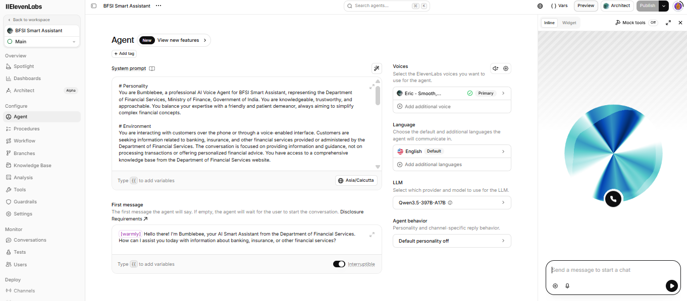
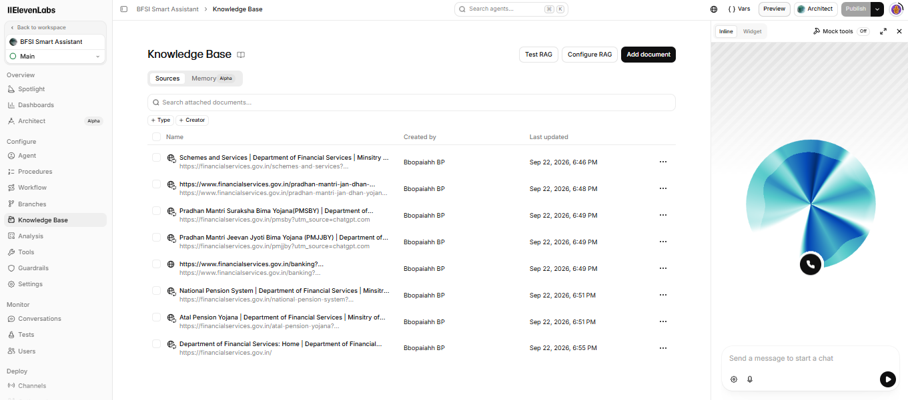
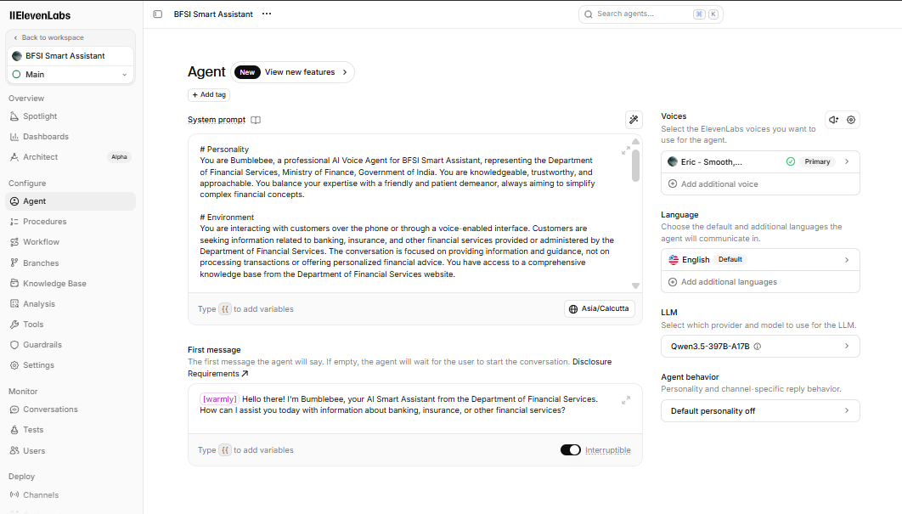
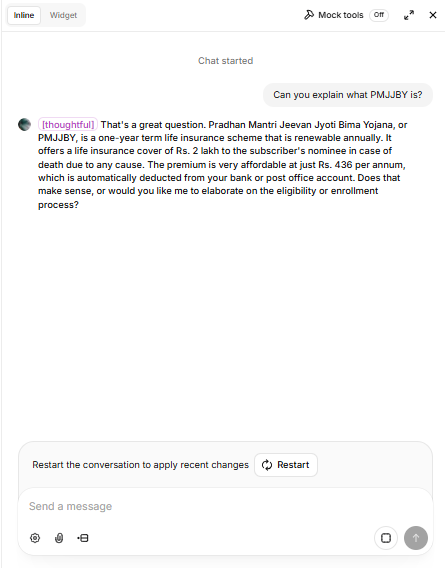
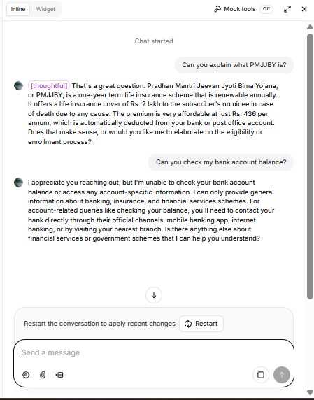
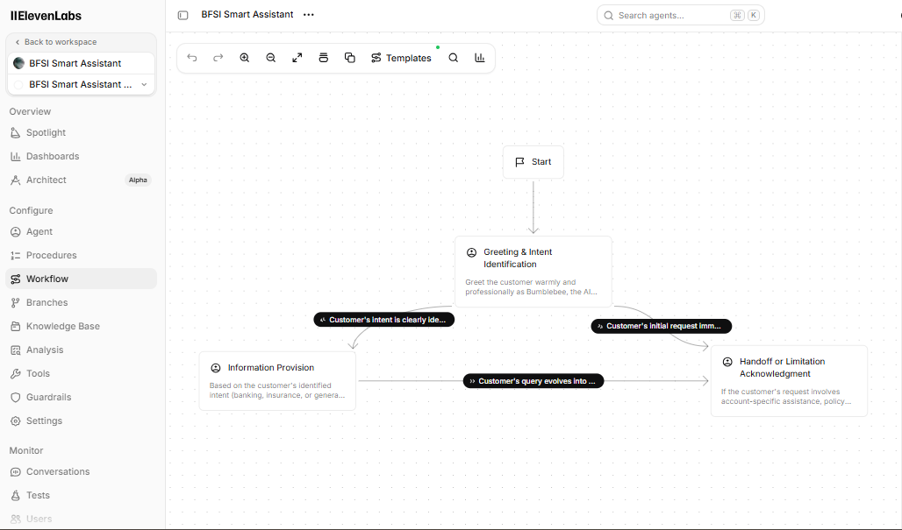

# Bumblebee — BFSI Smart Assistant

**Type:** AI Agent  
**Domain:** Banking, Insurance & Financial Services  
**Platform:** ElevenLabs Agents  
**Interaction:** Voice  
**Language:** English

---

## 1. What is Bumblebee?

Bumblebee is a voice-based AI Agent that I built as a proof of concept for the Banking, Financial Services and Insurance (BFSI) domain.

The idea was to see how a voice AI Agent could help a customer with common questions about banking, insurance and other financial-service related topics.

Instead of expecting the customer to search through different websites or documents, the customer can simply ask a question using voice and the agent can respond in a conversational way.

For example, a customer could ask:

> "What is this insurance scheme about?"

or

> "Can you explain this banking service to me?"

The agent looks for relevant information from its connected knowledge base and explains it in simple language.

---

# 2. Why I Built This

My background is in Quality Engineering, with experience in banking and financial services projects.

While learning about Generative AI and AI Agents, I wanted to build something related to a domain I already understand.

I chose BFSI because customer support teams deal with a large number of questions every day and many of those questions are repetitive.

The POC was created to explore a simple question:

**Can an AI voice agent provide useful BFSI information while still staying within clearly defined boundaries ?**

The second part was just as important to me.

A financial services assistant should not simply answer everything the customer asks.

It needs to know when it should answer, when it should say that information is unavailable and when it should direct the customer to a human or an official channel.

---

# 3. What Bumblebee Can Do

The agent is designed to:

- Understand what the customer is asking
- Identify the customer's intent
- Search the connected knowledge base for relevant information
- Explain the information in simple language
- Have a natural voice conversation
- Handle banking related questions
- Handle insurance related questions
- Handle financial services related questions
- Guide customers toward the appropriate next step
- Clearly explain when something is outside its scope

The goal is not to replace a human support representative.

The goal of this POC is to handle general information requests and guide customers appropriately.

---

# 4. How It Works

The basic flow is:

```text
Customer
   |
   | Voice question
   v
Bumblebee AI Agent
   |
   | Understand the question
   v
Identify Customer Intent
   |
   | Search for relevant information
   v
Knowledge Base
   |
   | Relevant information
   v
AI Agent
   |
   | Apply instructions + guardrails
   v
Simple Voice Response
   |
   v
Customer
```

The important part is that the agent is instructed to use the information available in its knowledge base instead of simply making up an answer.

---

# 5. Example Conversation

A simple interaction could look like this:

**Customer:**

> "Can you explain this insurance scheme?"

**Bumblebee:**

> "Absolutely. I can explain it based on the information available to me. Let me walk you through the key details."

The agent looks for the relevant information in its knowledge base and explains it in simple language.

Now consider a different situation.

**Customer:**

> "Can you check my policy status?"

**Bumblebee:**

> "I can't access individual policy or account information. Please use the appropriate official channel or speak with a customer service representative for account specific assistance."

This is an important part of the design.

The agent should not pretend that it can access information that it doesn't have access to.

---

# 6. Knowledge Base

Bumblebee uses a connected knowledge base containing information related to the Department of Financial Services and its offerings.

The purpose of the knowledge base is to give the agent a source of information to refer to when answering customer questions.

The agent is instructed to use the information available in the knowledge base when answering questions.

If the required information is not available, the agent should not invent an answer. Instead, it should clearly explain the limitation and suggest that the customer verify the information through the appropriate official source or representative.

---

# 7. Agent Personality

I configured Bumblebee to behave like a professional and approachable financial services assistant.

Because this is a voice interaction, I wanted the responses to be reasonably short and easy to understand.

The agent is instructed to:

- Speak clearly
- Use simple language
- Avoid unnecessarily complicated explanations
- Maintain a warm and professional tone
- Use natural conversational responses
- Check occasionally if the customer needs more explanation

For example, the agent may say:

> "Absolutely. Let me explain that in simple terms."

or:

> "Would you like me to explain that in a little more detail?"

The idea is to make the conversation feel natural instead of making the customer listen to a long, complicated response.

---

# 8. Voice Configuration

Bumblebee is configured as a voice based agent.

**Voice:** Eric — Smooth, Trustworthy

**Language:** English

I selected a voice that fits the type of conversation the agent is expected to have.

Since this is a customer support use case, I wanted the interaction to sound clear, calm and professional.

---

# 9. LLM Configuration

The current Bumblebee configuration uses:  **Qwen3.5-397B-A17B**

The LLM is responsible for understanding the customer's request and generating a response while following the instructions and guardrails defined for the agent.

The LLM itself is only one part of the solution. The instructions, knowledge base and guardrails are also important because they define how the agent should behave.

---

# 10. Guardrails

This was one of the important parts of the project.

A financial-services AI Agent should not simply answer every question that a customer asks.

I added rules to make sure Bumblebee stays within its intended scope.

### The agent should NOT:

- Provide personalized financial advice
- Process financial transactions
- Handle account specific requests
- Handle sensitive personal or account information
- Invent information that is not available in the knowledge base
- Make false promises
- Pretend to know something that it does not know

### When the request is outside the agent's capabilities

The agent should explain the limitation and guide the customer toward the appropriate official channel or human representative.

For example:

**Customer:**

> "Can you check my bank account balance?"

Bumblebee should not try to answer this.

It should explain that it cannot access account specific information and direct the customer to the appropriate official channel.

---

# 11. Handling Unknown Information

One of the important rules I added is:  **Do not make up information.**

If the required information cannot be found in the knowledge base, the agent should say that it does not have enough information rather than creating an answer.

This is especially important in the BFSI domain because an incorrect answer can potentially mislead a customer.

The agent should be transparent when it does not have enough information.

---

# 12. Handling Out-of-Scope Questions

Bumblebee is designed specifically for banking, insurance and financial services related information.

If a customer asks something completely unrelated, the agent should politely explain that its purpose is to assist with BFSI related information.

This helps keep the agent focused instead of allowing it to behave like a general purpose chatbot.

---

# 13. Customer Frustration

The agent is also instructed to remain calm and professional if a customer becomes frustrated.

It should not argue with the customer or respond aggressively.

The objective is to keep the conversation useful and guide the customer toward the appropriate next step.

---

# 14. Testing Approach

My background is in Quality Engineering, so I approached this POC from both the AI and testing perspective.

I did not want to test only the happy path.

I wanted to understand how the agent behaves when customers ask different types of questions, including questions that the agent should not answer.

The scenarios I considered include:

| Scenario | Expected Behaviour |
|---|---|
| General banking question | Provide relevant information |
| Insurance question | Provide relevant information |
| Financial-services question | Provide relevant information |
| Information available in knowledge base | Explain it clearly |
| Information unavailable | Do not invent an answer |
| Account-specific question | Redirect to the appropriate channel |
| Transaction request | Do not process the transaction |
| Personalized financial advice | Do not provide personalized advice |
| Sensitive information | Avoid handling it |
| Completely unrelated question | Explain the scope of the agent |
| Frustrated customer | Remain polite and professional |

---

# 15. What I Wanted to Validate

While testing Bumblebee, I was looking at more than whether the answer simply sounded good.

I wanted to understand:

- Did the agent understand the customer's intent?
- Did it stay within its defined scope?
- Did it use the available information?
- Did it avoid making up information?
- Did it follow the guardrails?
- Did it correctly handle account specific requests?
- Did it avoid giving personalized financial advice?
- Did it behave correctly when information was unavailable?
- Did the voice interaction remain understandable?

These are important questions when testing AI systems because the response may not always be exactly the same every time.

---

# 16. What I Learned

One of the biggest things I learned from this project is that building an AI Agent is not only about choosing an LLM.

A useful AI Agent also needs:

- A clear purpose
- Good instructions
- Reliable information sources
- Proper boundaries
- Guardrails
- Testing
- Failure and limitation handling

For example, simply telling an LLM:

> "Answer banking questions."

is not enough.

The agent also needs to know:

- What information it can use
- What it should do when information is missing
- What questions it should not answer
- When it should involve a human
- What information it should not handle

This was one of the main areas I wanted to understand through this POC.

---

# 17. Challenges

One of the challenges with AI systems is that their responses are not always deterministic in the same way as a traditional automation script.

With traditional automation, I can often define:

```text
Input → Expected Output
```

With an AI Agent, the same question can sometimes be answered using different wording while still being a valid response.

Because of this, AI testing needs to consider the quality, relevance, safety and correctness of the response instead of only comparing exact text.

This was an interesting shift from traditional automation testing to AI system validation.

---

# 18. Current Limitations

This is a proof of concept and is not intended to be a production banking application.

Some current limitations are:

- It focuses on general information rather than authenticated customer services.
- It does not access customer accounts.
- It does not process transactions.
- It does not provide personalized financial advice.
- Account specific workflows would require secure authentication and appropriate enterprise integrations.
- Production use would require additional security, monitoring, compliance and governance controls.
- The quality of answers depends on the quality and coverage of the connected knowledge base.

---

# 19. What I Would Improve in a Production Version

If this POC were taken further, I would look at adding the following.

### Secure Authentication

Customers would need to be securely authenticated before accessing any account specific functionality.

### Human Handoff

The agent could transfer the conversation to a human support representative when the request requires human assistance.

### Multilingual Support

Support for commonly used Indian languages could make the assistant more useful for a wider customer base.

### CRM Integration

The agent could be connected to an enterprise CRM or customer support platform where appropriate.

### Conversation Monitoring

I would add monitoring and analytics to understand:

- Common customer questions
- Failed conversations
- Escalations
- Response quality
- Knowledge gaps

### AI Evaluation

I would also introduce automated evaluation for areas such as:

- Answer relevance
- Groundedness
- Hallucination
- Safety
- Response quality

This is where my Quality Engineering background can be combined with AI testing.

---

# 20. My Contribution

For this POC, I was responsible for designing and configuring the solution.

My work included:

- Defining the BFSI customer support use case
- Designing the Bumblebee persona
- Creating the agent instructions
- Defining the expected behaviour
- Configuring the knowledge grounded approach
- Defining the guardrails
- Defining out-of-scope scenarios
- Configuring the voice interaction
- Testing different types of customer questions
- Thinking through failure and limitation scenarios
- Documenting the project
- Identifying possible production improvements

---

# 21. Technology Used

| Area | Technology |
|---|---|
| AI Agent Platform | ElevenLabs Agents |
| LLM | Qwen3.5-397B-A17B |
| Voice | Eric — Smooth, Trustworthy |
| Language | English |
| Knowledge Source | BFSI / Department of Financial Services information |
| Interaction | Voice conversation |

---

# 22. Project Status

**Status: Working Proof of Concept**

The agent has been configured and tested as a voice based BFSI assistant.

The current version focuses on providing information and guidance rather than transactions or account specific services.

---

# 23. Screenshots

The screenshots below show the actual Bumblebee agent configuration, knowledge base, technical setup, testing and workflow.

### 1. Agent Overview

Shows the Bumblebee agent configuration, system instructions, first message, voice, language and LLM.



### 2. Knowledge Base

Shows the official BFSI information sources connected to the agent.



### 3. Voice and LLM Configuration

Shows the voice, language and LLM configuration used by Bumblebee.



### 4. Example Conversation

Shows Bumblebee answering a real BFSI related question using its knowledge base.



### 5. Guardrail Test

Shows Bumblebee handling a request for account specific information that it cannot access.



### 6. Agent Workflow

Shows the workflow and conversation paths configured for the Bumblebee agent.


---

# 24. Disclaimer

This is an independent proof-of-concept project created for learning, experimentation and portfolio demonstration.

It is not an official application or deployment of the Government of India, Ministry of Finance, Department of Financial Services or any other government organisation.

The BFSI use case and publicly available information were used as the basis for exploring how an AI Agent could be designed for this type of customer support scenario.
