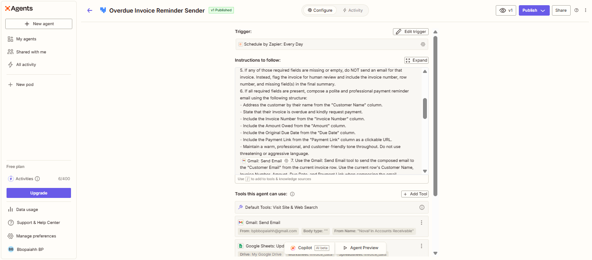
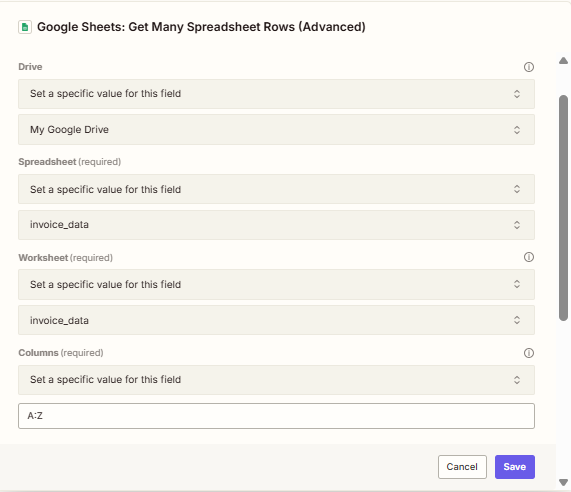
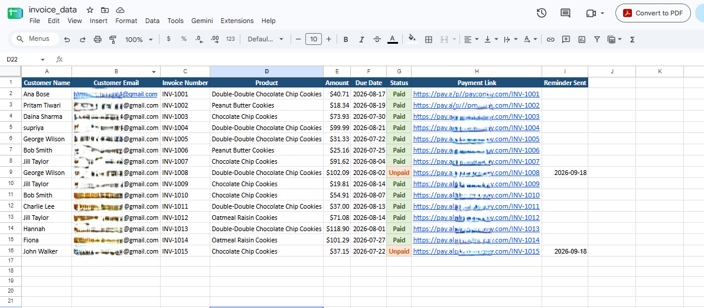
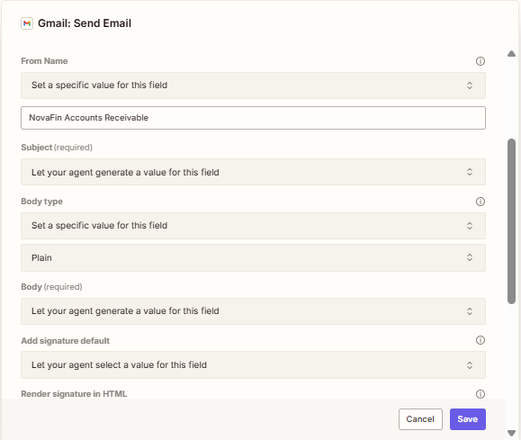
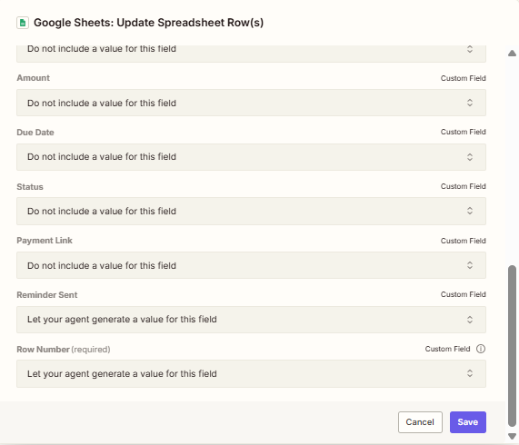
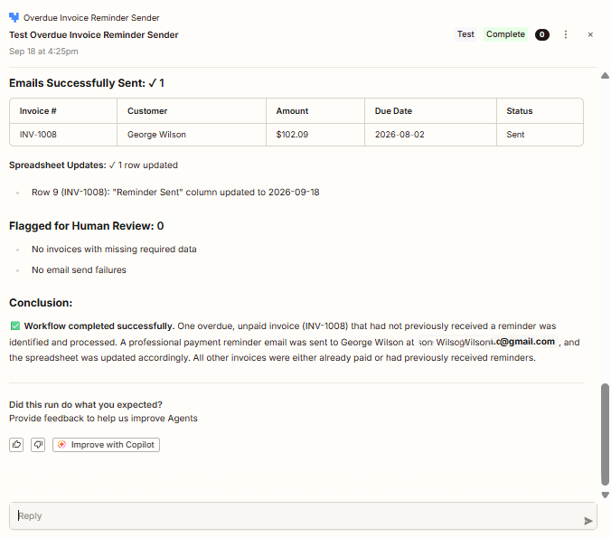
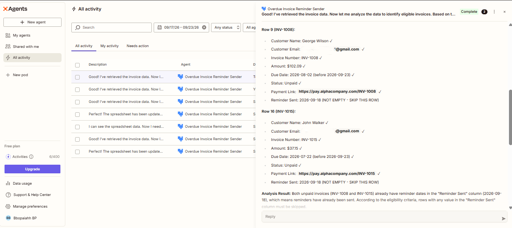

# NovaFin — Invoice Payment Agent

**Type:** AI Agent  
**Domain:** Finance / Accounts Receivable  
**Platform:** Zapier Agents  
**Interaction:** Automated workflow  
**Tools:** Google Sheets, Gmail  
**Status:** Working POC

---

# 1. What is NovaFin?

NovaFin is an AI Agent I built to automate the process of identifying overdue invoices and sending payment reminder emails.

The agent reads invoice information from a Google Sheet, checks which invoices are eligible for a reminder, sends an email to the customer and then updates the same spreadsheet after the email is successfully sent.

The idea was to take a repetitive Accounts Receivable activity and turn it into an automated workflow with business rules and safeguards.

Instead of someone manually checking the spreadsheet every day, finding overdue invoices and sending reminders one by one, NovaFin can handle that process automatically.

The agent was designed to follow specific rules rather than simply sending an email for every invoice.

---

# 2. Why I Built This

I wanted to build an AI Agent that could do more than answer questions.

A real agent should be able to:

- Read information
- Understand business rules
- Make a decision based on those rules
- Perform an action
- Update the source system
- Handle failures safely

Invoice payment reminders are a good example because the process is repetitive but still requires some business logic.

For example: An invoice should not receive a reminder just because it exists in the spreadsheet.

The invoice needs to meet specific conditions before the agent can send anything.

That made this a good use case for experimenting with AI Agents and workflow automation.

---

# 3. What NovaFin Does

The basic workflow is:

```text
Google Sheets
      |
      | Read invoice records
      v
NovaFin AI Agent
      |
      | Check business rules
      v
Is the invoice eligible?
      |
      +---- No ----> Skip the invoice
      |
      +---- Yes
             |
             v
       Validate required data
             |
             v
        Send Gmail reminder
             |
             v
       Was email successful?
          /          \
        No            Yes
        |              |
        v              v
 Human review     Update Google Sheet
                       |
                       v
                Process next invoice
```

The important part is that the spreadsheet is not updated before the email is successfully sent.

This helps prevent the agent from marking an invoice as reminded when the email was never actually sent.

---

# 4. How It Works

NovaFin runs on a scheduled basis.

The agent reads invoice records from a Google Sheet and evaluates each row.

For every invoice, it checks whether:

1. The status is exactly `Unpaid`
2. The due date is earlier than today's date
3. The `Reminder Sent` field is empty

If any of these conditions are not satisfied, the invoice is skipped.

If the invoice is eligible, the agent checks whether the required information is available.

The required information includes:

- Customer Name
- Customer Email
- Invoice Number
- Amount
- Due Date
- Payment Link

If required information is missing, NovaFin does not send the email.

Instead, the record is identified for human review.

If all required information is available, the agent generates a payment reminder and sends it using Gmail.

Only after a successful email send does the agent update the `Reminder Sent` field in Google Sheets.

---

# 5. Google Sheets Data

NovaFin uses a Google Sheet called: `invoice_data`

The worksheet is also named: `invoice_data`

The columns used in the workflow are:

| Column | Field |
|---|---|
| A | Customer Name |
| B | Customer Email |
| C | Invoice Number |
| D | Product |
| E | Amount |
| F | Due Date |
| G | Status |
| H | Payment Link |
| I | Reminder Sent |

The spreadsheet acts as the source of invoice information and also stores the result of the reminder process.

---

# 6. Business Rules

I intentionally kept the business rules explicit so that the agent does not make its own assumptions.

An invoice is eligible only when:

```text
Status = Unpaid AND Due Date < Today AND Reminder Sent is empty
```

If the invoice does not satisfy all three conditions, the agent skips it.

This was important because I wanted to test whether the agent could consistently follow defined business rules instead of simply using natural language judgment.

---

# 7. Required Data Validation

Before sending an email, NovaFin checks that the important information is available.

The required fields are:

```text
Customer Name
Customer Email
Invoice Number
Amount
Due Date
Payment Link
```

If one of these values is missing, the agent should not send the reminder.

Instead, it should identify the invoice for human review.

This adds a simple validation layer before the external action is performed.

---

# 8. Tools Used

NovaFin uses three main tools.

### 1. Google Sheets

Used to:

- Read invoice records
- Evaluate invoice information
- Update the `Reminder Sent` field

### 2. Gmail

Used to:

- Send payment reminder emails
- Send the email to the customer address from the spreadsheet

### 3. Zapier Agents

Used to:

- Orchestrate the workflow
- Apply the business rules
- Decide which invoices need action
- Generate the reminder email
- Control the order of operations

---

# 9. Agent Tools Configuration

The agent has three connected tools.

### Tool 1 : Get Many Spreadsheet Rows

The agent reads invoice records from the `invoice_data` worksheet.

The configuration was set to read the required spreadsheet range and process the returned records.

### Tool 2 : Send Gmail

The agent generates the recipient, subject and email body based on the invoice information.

The sender is configured as: `NovaFin Accounts Receivable`

### Tool 3 : Update Spreadsheet Rows

After a successful email send, the agent updates the corresponding row.

The main value updated is: `Reminder Sent`

The row number is also supplied so the correct invoice record is updated.

---

# 10. Email Generation

NovaFin does not use one fixed email for every customer.

The agent generates the reminder using the invoice information available in the spreadsheet.

The reminder includes information such as:

- Customer name
- Invoice number
- Amount
- Due date
- Payment link

The message is intended to be polite and professional rather than aggressive.

The goal is to remind the customer about the outstanding invoice and provide a convenient way to make the payment.

---

# 11. Important Safety Rule

One of the most important rules in the agent is:

**Only update the spreadsheet after the email has been successfully sent.**

The intended flow is:

```text
Check invoice
     |
     v
Eligible?
     |
     v
Validate data
     |
     v
Send email
     |
     v
Successful?
   /      \
 No        Yes
 |          |
 v          v
Do not    Update
update    Reminder Sent
```

If the email fails, the `Reminder Sent` field should remain empty.

This prevents a failed email from being incorrectly recorded as a successful reminder.

---

# 12. Handling Incomplete Data

NovaFin also handles incomplete invoice records.

For example: If an overdue invoice is missing the customer's email address, the agent should not attempt to send the reminder.

Instead, it should identify the problem for human review.

This was included intentionally because automation should not blindly execute an action when the required information is incomplete.

---

# 13. Handling Already Processed Invoices

The `Reminder Sent` field is used to prevent duplicate reminders.

If the field already contains a value, the agent skips that invoice.

For example:

```text
Status = Unpaid
Due Date = Past
Reminder Sent = 2026-09-18
```

Even though the invoice is overdue, it should not receive another reminder because the reminder has already been recorded.

---

# 14. Scheduled Execution

NovaFin is designed to run on a daily schedule.

The idea is that the agent can periodically check the invoice spreadsheet and process newly eligible overdue invoices.

This removes the need for someone to manually check the spreadsheet every day.

The schedule can also be changed depending on the business requirement.

For example: A production system could run the process:

- Once a day
- Multiple times during the day
- At a specific Accounts Receivable processing time

For this POC, the workflow was configured for daily execution.

---

# 15. Testing Approach

I tested the workflow using sample invoice records in Google Sheets.

The testing focused on more than simply checking whether an email was received.

I wanted to verify:

- Correct invoice selection
- Business rule evaluation
- Required field validation
- Email generation
- Email delivery
- Spreadsheet update
- Duplicate prevention
- Handling of failed or invalid conditions

---

# 16. Test Scenarios

The main scenarios tested were:

| Scenario | Expected Result |
|---|---|
| Unpaid + overdue + Reminder Sent empty | Send reminder |
| Paid invoice | Skip |
| Future due date | Skip |
| Reminder already recorded | Skip |
| Missing customer email | Do not send |
| Missing payment link | Do not send |
| Email successfully sent | Update Reminder Sent |
| Email sending failure | Do not update Reminder Sent |

This helped me validate both the positive and negative paths.

---

# 17. Actual Test

I tested NovaFin with overdue invoice records containing customer and invoice information.

The agent correctly identified an eligible overdue invoice and generated a payment reminder.

The email was successfully sent to the configured recipient account.

After the successful send, the reminder status was recorded in the spreadsheet.

I also tested an invoice that already had a `Reminder Sent` value.

The agent correctly skipped that record instead of sending another reminder.

---

# 18. Email Delivery Observation

During testing, the reminder email reached the recipient account but was placed in the **Spam** folder.

This was useful because it showed an important real-world limitation of email automation.

The agent can successfully trigger the email, but final inbox placement is also influenced by the receiving email provider.

For a production implementation, I would use the company's official business email domain and configure the required email authentication and security settings to improve email deliverability and reduce the chance of legitimate reminders being marked as spam.

I would also monitor email delivery and bounce information.

---

# 19. What I Wanted to Validate

The main things I wanted to prove with NovaFin were:

1. Can an AI Agent read structured business data?
2. Can it follow clearly defined business rules?
3. Can it decide which records require action?
4. Can it interact with external tools?
5. Can it perform an action such as sending an email?
6. Can it update the source system after the action?
7. Can it avoid duplicate processing?
8. Can it stop when required information is missing?

The project helped me understand how AI Agents can be combined with traditional workflow automation.

---

# 20. What I Learned

One of the biggest things I learned is that an AI Agent is not just about the AI model.

The surrounding workflow is equally important.

A useful agent needs:

- Clear instructions
- Reliable data
- Business rules
- Tool access
- Validation
- Error handling
- Safe action sequencing
- Testing

For example, simply telling an agent to "send reminders for overdue invoices" is not enough.

The agent needs to know exactly what qualifies as overdue, what information is required, when an email can be sent and when the spreadsheet can be updated.

---

# 21. Challenges

One challenge was making sure the agent did not send reminders for every invoice.

The business rules had to be explicit.

Another important challenge was controlling the order of operations.

The spreadsheet should only be updated after the email has successfully been sent.

I also observed the difference between an email being successfully sent and an email reaching the recipient's inbox.

The Spam result during testing was a good example of why production automation needs monitoring beyond the workflow itself.

---

# 22. Current Limitations

This is a proof-of-concept and not a production Accounts Receivable system.

Some current limitations include:

- Gmail is being used for the email action
- Google Sheets is being used as the data source
- Email delivery monitoring is limited
- No payment gateway integration
- No ERP integration
- No customer portal
- No escalation workflow
- No advanced retry mechanism
- No approval workflow for high value invoices
- Business rules are intentionally simple

These are areas that could be addressed in a production implementation.

---

# 23. What I Would Improve in a Production Version

If I were taking NovaFin further, I would add:

### Better Data Source

Integrate with an ERP or Accounts Receivable system instead of relying on Google Sheets.

### Email Reliability

Use the company's official business email account and follow the organization's standard email security and delivery practices.

This would help improve email deliverability and reduce the chance of legitimate payment reminders being marked as spam.

### Retry Handling

Introduce controlled retries for temporary email or integration failures.

### Escalation

Create escalation rules for invoices that remain unpaid after multiple reminders.

For example:

```text
First reminder
      |
      v
Still unpaid
      |
      v
Second reminder
      |
      v
Still unpaid
      |
      v
Escalate to Accounts Receivable team
```

### Approval Controls

For high value invoices, require human approval before sending the reminder.

### Monitoring

Track:

- Emails sent
- Emails failed
- Bounce rates
- Reminder counts
- Processing errors
- Invoices requiring human review

---

# 24. My Contribution

I designed and built the NovaFin proof-of-concept.

My work included:

- Selecting the invoice reminder use case
- Designing the workflow
- Defining the business rules
- Configuring the Google Sheets integration
- Configuring the Gmail integration
- Writing the agent instructions
- Defining the validation rules
- Controlling the update-after-success behavior
- Testing positive and negative scenarios
- Testing duplicate prevention
- Observing real email delivery behavior
- Identifying production limitations
- Documenting the complete workflow

The main focus was not just making the agent send an email.

I wanted to understand how to build an agent that can make a controlled decision and then safely perform an action.

---

# 25. Technology Used

| Technology | Purpose |
|---|---|
| Zapier Agents | AI Agent and workflow orchestration |
| Google Sheets | Invoice data source |
| Gmail | Payment reminder delivery |
| AI / LLM | Decision-making and email generation |
| Business Rules | Invoice eligibility logic |

---

# 26. Project Status

**Status: Working Proof of Concept**

The agent was configured, published and tested with sample invoice data.

The workflow successfully demonstrated:

- Reading invoice records
- Identifying overdue invoices
- Applying business rules
- Generating reminder emails
- Sending emails
- Updating the spreadsheet after successful sending
- Skipping already processed invoices

The project is intended as a learning and portfolio project demonstrating practical AI Agent development.

---

# 27. Screenshots

The screenshots below show the actual NovaFin agent configuration, invoice data, integrations and testing results.

### 1. Agent Overview

Shows the NovaFin agent, daily schedule, instructions, connected tools and published version.



### 2. Google Sheets Configuration

Shows the Google Sheets tool used to retrieve invoice records from the `invoice_data` worksheet.



### 3. Invoice Data Sheet

Shows the sample invoice structure used by NovaFin, including invoice number, product, amount, due date, status and reminder status.



### 4. Gmail Configuration

Shows the Gmail tool used to generate and send payment reminder emails.



### 5. Google Sheets Update Configuration

Shows the Google Sheets update tool used to record the `Reminder Sent` value and identify the correct spreadsheet row.



### 6. Successful Reminder Test

Shows an actual successful NovaFin test where an eligible overdue invoice was identified, the reminder email was sent successfully, and the spreadsheet was updated.



### 7. Duplicate Prevention Test

Shows NovaFin identifying invoices that had already received reminders and skipping them instead of sending another email.


---


# 28. What This Project Demonstrates

This project demonstrates my understanding of:

- AI Agents
- Workflow automation
- Business-rule implementation
- Tool integration
- Structured data processing
- Conditional decision-making
- Email automation
- Validation
- Error handling
- Duplicate prevention
- End-to-end testing
- Production limitations

It also helped me understand how AI can be combined with traditional automation to build practical business workflows.

---

# 29. Disclaimer

This is an independent proof-of-concept project created for learning, experimentation and portfolio demonstration.

It is not an official production system for any bank, financial institution, company or Accounts Receivable department.

The invoice data used for demonstration and testing is sample/test data.
